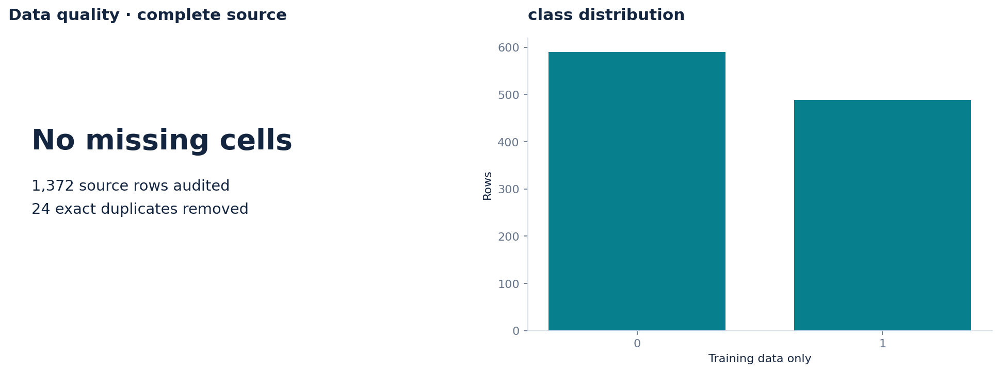
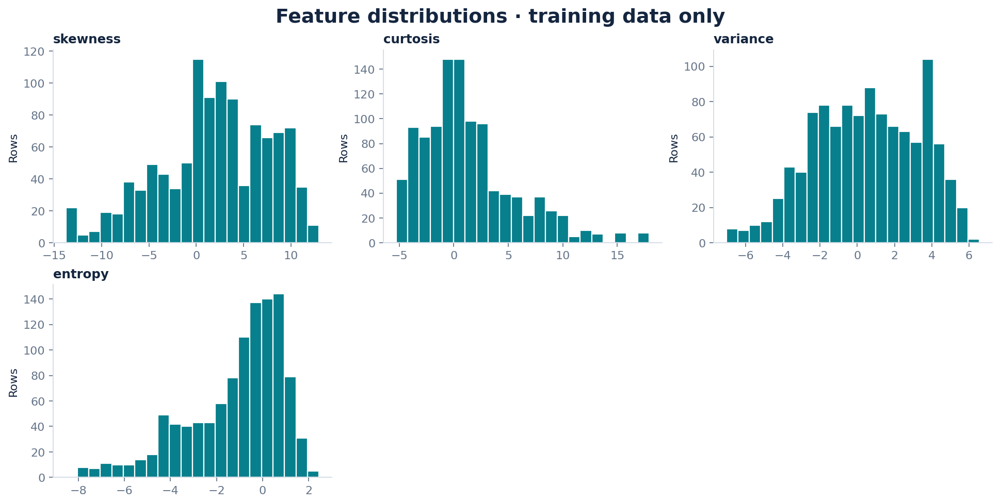
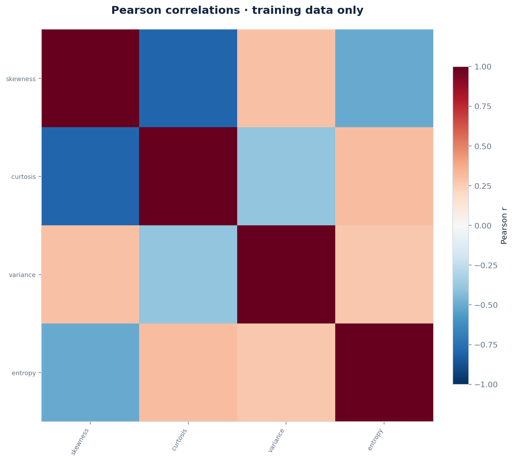
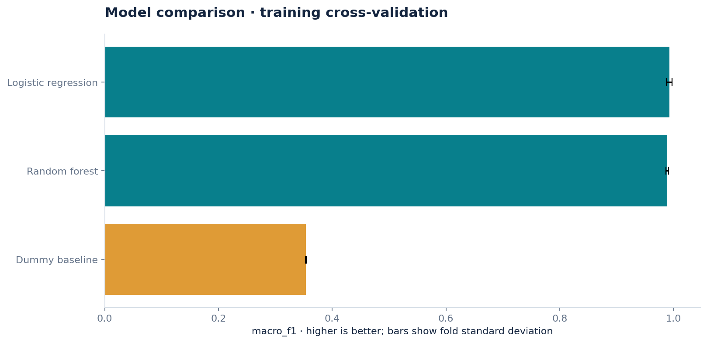
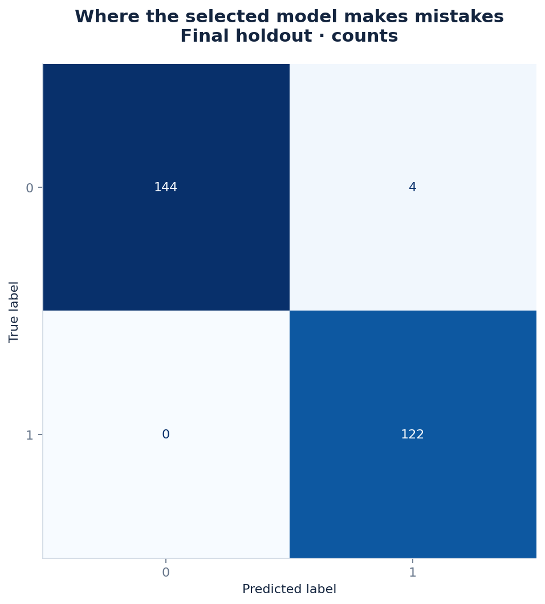
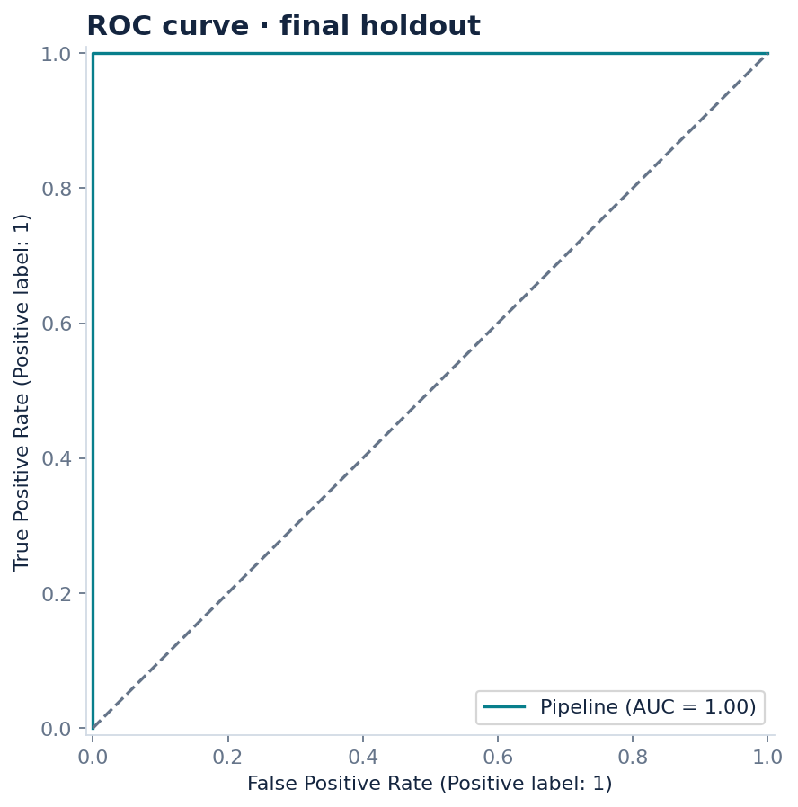
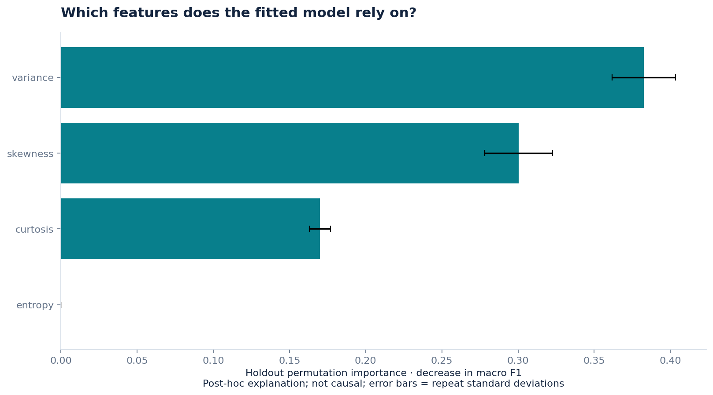

# Banknote authentication from image statistics

**2026-09-05 · CLASSIFICATION · **

## Research question

How well do image-derived statistics separate the two banknote classes?

## Results

Logistic regression was selected using training cross-validation. Its holdout macro_f1 was 0.9851, versus 0.3541 for the dummy baseline; it improved on that baseline on this holdout.

Training macro_f1 was 0.9944. The training/holdout difference is descriptive; it is not an independent estimate of model uncertainty.

variance had the largest mean permutation score drop (0.3825). This measures the fitted model's reliance on a feature, not a causal effect; correlated features can share importance.

The selected model made 4 errors among 270 holdout examples. Inspect the confusion matrix and per-class metrics before relying on overall accuracy.

The strongest absolute Pearson feature correlation in the training data was skewness / curtosis (|r| = 0.796); this suggests checking redundancy, not concluding causality.

## Evaluation design

Stratified random holdout; stratified cross-validation on training rows. Training rows: 1078; final holdout: 270. Seed: 42.

Missing-value imputation, scaling and category encoding are fitted inside each CV training fold. Model selection uses training CV only. The frozen winner and dummy baseline are then scored on the holdout. The baseline is allowed to win.

### Training cross-validation

| Model | macro_f1 | Fold SD |
| --- | --- | --- |
| Logistic regression | 0.9925 | 0.0048 |
| Random forest | 0.9888 | 0.0023 |
| Dummy baseline | 0.3537 | 0.0005 |

Fold standard deviations are descriptive spread, not confidence intervals. The best CV score is selection-optimistic.

### Final holdout

| Model | Metric | Value |
| --- | --- | --- |
| Logistic regression | accuracy | 0.9852 |
| Logistic regression | macro_f1 | 0.9851 |
| Logistic regression | balanced_accuracy | 0.9865 |
| Logistic regression | roc_auc | 1.0000 |
| Dummy baseline | accuracy | 0.5481 |
| Dummy baseline | macro_f1 | 0.3541 |
| Dummy baseline | balanced_accuracy | 0.5000 |
| Dummy baseline | roc_auc | 0.5000 |

Approximate 95% percentile bootstrap interval for macro_f1: **0.9702–0.9964** (200 resamples). Percentile bootstrap on fixed-model holdout predictions; stratified by class for classification. Conditional on this fitted model and split; excludes training/model-selection uncertainty.

## Data provenance

Source: [https://archive.ics.uci.edu/dataset/267/banknote+authentication](https://archive.ics.uci.edu/dataset/267/banknote+authentication)

License: CC BY 4.0. Attribution and source description are in SOURCE.md. The exact analyzed snapshot and its SHA-256 are retained.

## Data quality

| Check | Value |
| --- | --- |
| original rows | 1372 |
| original features | 4 |
| missing cells | 0 |
| missing target rows removed | 0 |
| exact duplicates removed | 24 |
| usable rows | 1348 |

Excluded from predictors: none specified. See data_dictionary.csv for column types, missingness and uniqueness.

## Visual evidence



Missing values and target distribution.



Numeric feature distributions; up to six features by training/sample variance.



Feature associations; correlation does not imply causation.



Candidate model comparison; error bars are fold standard deviations, not confidence intervals.



Confusion matrix on the final holdout.



ROC curve; the threshold was not optimized on the holdout.



Permutation feature importance of the selected model.

## Limitations

Features were extracted from a controlled imaging setup; this study does not validate performance under new cameras or counterfeit techniques.

The automated pipeline cannot infer all leakage paths, sampling bias, entity grouping or business meaning. Feature importance is post-hoc and is not used to choose the winner. Any follow-up tuned after inspecting this holdout needs a fresh final evaluation.

## Reproduce

From the repository root, install requirements.txt and run:

```bash
python daily_ds/reproduce.py projects/2026-09-05-banknote
```

The command uses the saved snapshot, configuration and dataset specification, and writes to reproduced/. analysis.ipynb provides a readable walkthrough. Numeric results may differ slightly across platforms; software versions and code hashes are recorded.
